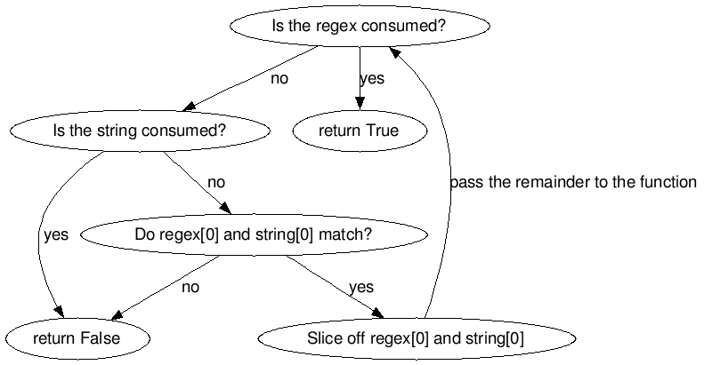

# Work on project. Stage 2/6: Matching two equal length strings

## Description

A single character is not a lot, so let's extend our new regex engine to handle regex-string pairs of equal length. Don't forget about supporting the wildcard symbol! It is still not the most realistic way to use a regex engine, but we are slowly getting there.

## Objectives

Create a new function that calls the function from the first stage on every character of the regex-string pair and returns True only if there is a match for every character. In other words, for a complete match, either every character pair should be the same, or the regex should contain a wild card. There are different ways to achieve this, but the most elegant is probably recursion.

Recall that recursion is when a function calls itself from its own code. It can be used to break down a problem into smaller steps, thus simplifying the code.

This is exactly what you are going to do in this stage! First, invoke the function from the first stage on the first characters of the regex-string pair. If there is a match, pass the remainder of the string recursively to the same function, but this time without the first characters of the regex and the input string, thus "consuming" them step by step.

Some terminating conditions should be added to stop the function from entering infinite recursion:

    If the regex has been entirely consumed, the function should return True since it means that all the characters in the regex-string pair are the same.
    If the regex has not been consumed but the input string has, the function should return False since it means that the regex is longer than the input string, which is undefined behavior at this point.
    If the first character of the regex does not match the first character of the input string, the function should return False because it guarantees that the two patterns are different.

If none of the above apply, the recursion should continue until the regex-string pair is entirely consumed through slicing.

This logic can be illustrated as follows:

Note that some of the steps can be concatenated with the help of boolean logic and smartly coined return statements. If your program works but you find it awkward or overly complicated, try to combine some of the steps to make your code more readable.
Examples

    Input: 'apple|apple'     Output: True
    Input: '.pple|apple'     Output: True
    Input: 'appl.|apple'     Output: True
    Input: '.....|apple'     Output: True
    Input: 'peach|apple'     Output: False